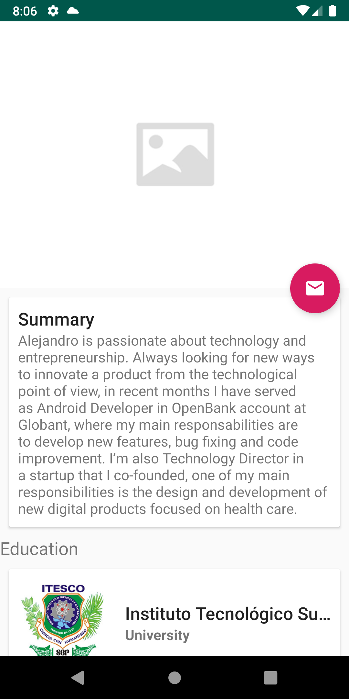
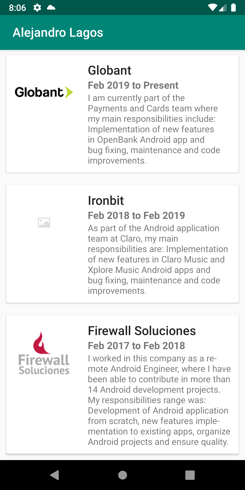

# MyCV App - Android
Curriculum vitae example app, made with Kotlin + MVP

## Used GIST (profile.json)
https://gist.githubusercontent.com/alejandrolagosr/cc2871f6c0dd8f84d15fc564078e608b/raw/a183e0db539e7421fb2238209d8137fc9f48521b/profile.json

